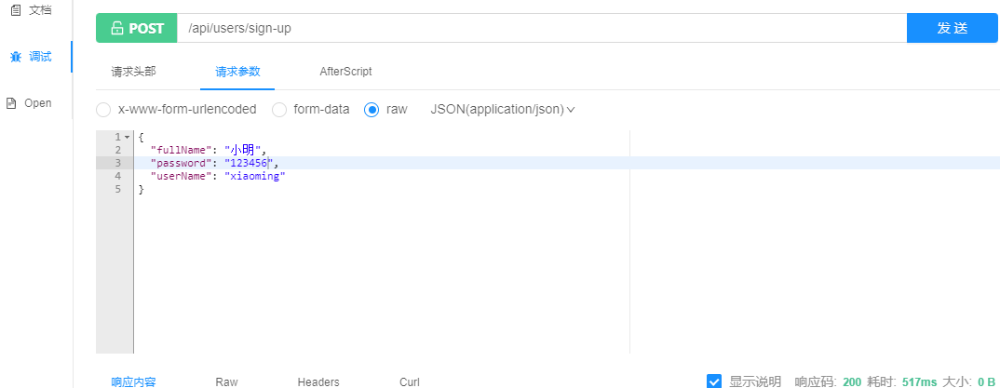
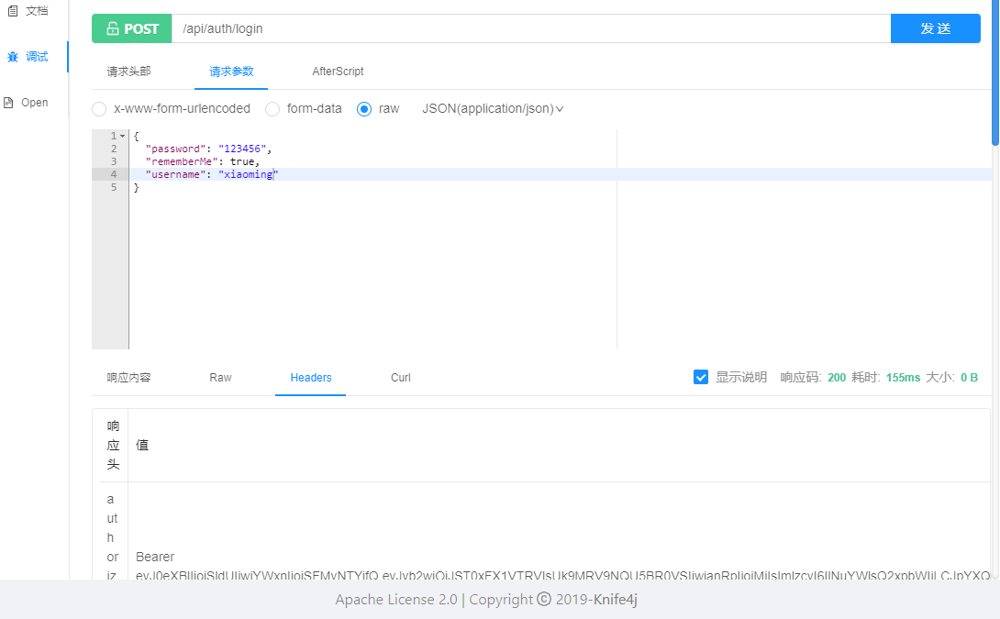
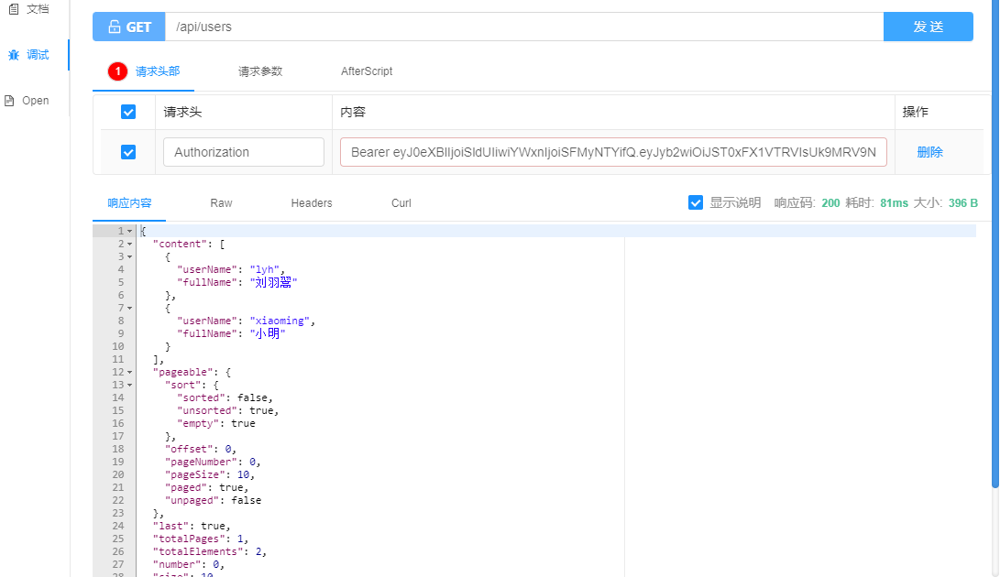
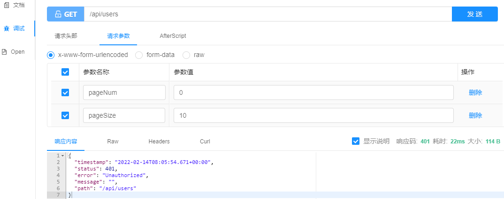
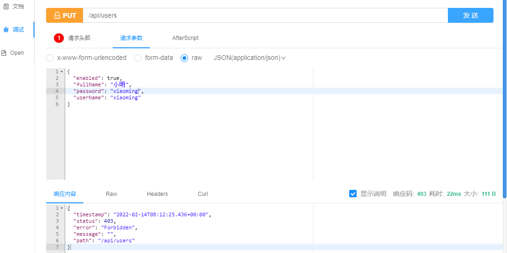

# Spring Security JWT Demo

[项目介绍](#项目介绍) | [效果展示](#效果展示) | [参考资料](#参考资料) 

ʕ•̫͡•ʔ-̫͡-ʕ•͓͡•ʕ•̫͡•ʔ-̫͡-ʕ•͓͡•ʔ-̫͡-ʔ

## 项目介绍

项目中用到的一些框架/服务：

- 数据库：MySQL
- 缓存：Redis
- 权限框架：Spring Security
- ORM框架：JPA（低SQL）
- 接口文档：Swagger

在线 API 文档地址：http://localhost:9898/api/swagger-ui/ 

使用 knife4j 增强了 swagger 功能，地址： http://localhost:9898/api/doc.html （推荐👍）

## 效果展示

1、注册新账号

`POST /api/users/sign-up`

2、使用账号登录

`POST /api/auth/login`

3、使用正确的Token访问需要进行身份验证的资源

`GET /api/users`

4、不带Token或使用无效Token

`GET /api/users`

5、带了正确的Token但是权限不足

`PUT /api/users`

## 参考资料

[https://github.com/Snailclimb/spring-security-jwt-guide](https://github.com/Snailclimb/spring-security-jwt-guide)

[https://github.com/spring-projects/spring-security](https://github.com/spring-projects/spring-security)

[https://spring.io/projects/spring-security](https://spring.io/projects/spring-security)

